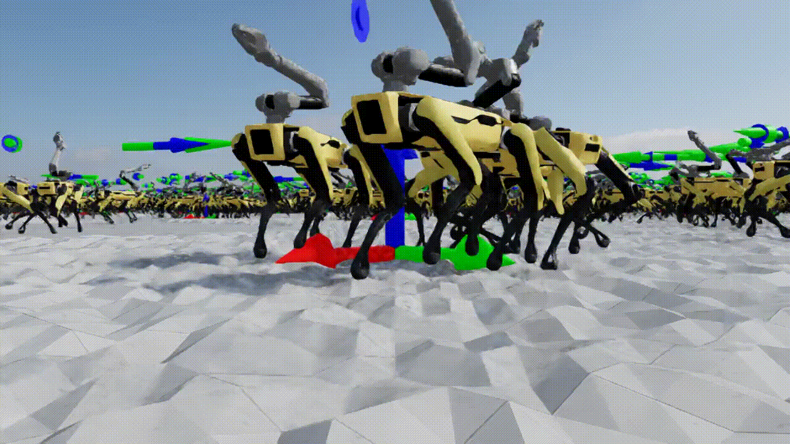

# IsaacRobotics based on NVIDIA IsaacSim and IsaacLab

[](LICENSE)
[](https://github.com/mschweig/IsaacRobotics/stargazers)
[](https://github.com/mschweig/IsaacRobotics/issues)
[](https://github.com/mschweig/IsaacRobotics/commits/main)

**Reinforcement Learning-Controlled Robotics Simulation for Spot and Spot Arm in NVIDIA Isaac Sim**

---

## Overview

This project provides example applications, pre-trained policies, and environment configurations for research and prototyping of autonomous quadruped and manipulator behaviors in complex environments such as warehouses.

The system leverages the power of Isaac Sim physics simulation and bridges it with ROS 2 for real-time testing and robotic development workflows.

---

## Features

* ✅ Isaac Sim simulation environments for Spot and Spot Arm
* ✅ RL policy controllers for locomotion
* ✅ Example applications including warehouse navigation
* ✅ ROS 2 bridge support for interfacing with external systems
* ✅ Modular and extensible structure for adding new robot models and policies

---

## Requirements

* NVIDIA Isaac Sim
* ROS 2 Humble
* rmw_zenoh
* GPU: NVIDIA RTX 40xx or better

---

## Installation

1. Clone the repository:

```bash
git clone https://github.com/mschweig/IsaacRobotics.git
cd IsaacRobotics
```

2. Install Isaac Sim and required extensions (refer to Isaac Sim documentation).

3. (Optional) Install ROS 2 Humble and enable `isaacsim.ros2.bridge` extension in Isaac Sim.

---

## Usage

### Run Spot Arm in Warehouse Scenario

```bash
cd applications
python spot_warehouse.py
```

Control the robot via keyboard:

| Key               | Command       |
| ----------------- | ------------- |
| UP / NUMPAD\_8    | Move forward  |
| DOWN / NUMPAD\_2  | Move backward |
| LEFT / NUMPAD\_4  | Strafe left   |
| RIGHT / NUMPAD\_6 | Strafe right  |
| N / NUMPAD\_7     | Rotate left   |
| M / NUMPAD\_9     | Rotate right  |

### RL Policy Testing

The `applications/spot_policy.py` contains example implementations of PolicyControllers for Spot and Spot Arm.
You can adapt these for your custom simulation experiments.

---

## Media

### Spot Arm Policy



---

## License

This project is licensed under the Apache License 2.0. See [LICENSE](LICENSE) for details.

NVIDIA proprietary code (e.g., RL policies) remains under NVIDIA's licensing terms.
